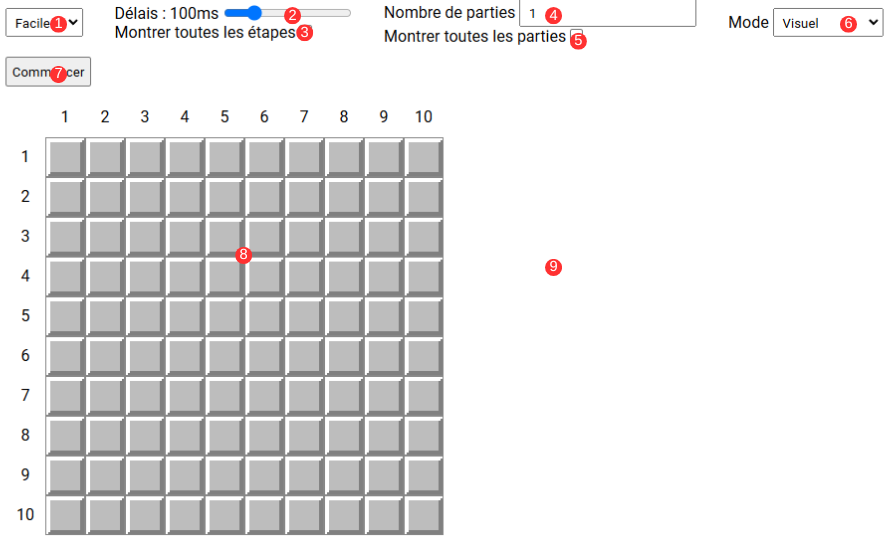

# Projet IA - Démineur

## Sommaire

- [Démarrage du projet](#démarrage-du-projet)
  - [En local](#en-local)
    - [Chargement du code en local](#chargement-du-code-en-local)
    - [Installation des dépendances](#installation-des-dépendances)
    - [Démarrage du serveur](#démarrage-du-serveur)
  - [En ligne](#en-ligne)
- [Utilisation du bot](#utilisation-du-bot)
  

## Démarrage du projet

### En local

Pour cette méthode, assurez-vous avant d'avoir Node.js et npm d'installés. Si ce n'est pas le cas, installez les ou allez à la section [En ligne](#en-ligne).

#### Chargement du code en local

Tout d'abord, vous devez mettre le code sur votre machine.

Pour cela deux méthodes :

1. Avec Git en utilisant la commande `git clone git@github.com:leo-jcq/projet-ia.git` ou `git clone https://github.com/leo-jcq/projet-ia.git` (si vous préférez HTTPS à SSH).
2. Depuis GitHub :
    - Rendez-vous sur la page du repository ([https://github.com/leo-jcq/projet-ia](https://github.com/leo-jcq/projet-ia)).
    - En haut à droite des fichiers cliquez sur le bouton vert avec marqué "Code".
    - Cliquez ensuite sur "Download ZIP".
    - Extrayiez l'archive.

#### Installation des dépendances

Ce projet est un site web développé typescript, il faut donc installer les dépendances :

- `typescript` pour la transpilation du code en javascript.
- `vite` pour créer un serveur de développement et build l'application.
- `sass` pour compiler le SCSS en CSS.
- D'autres librairies comme `vitest` moins importantes.

Pour cela :

- Ouvrez un terminal dans le mêm dossier que votre code.
- Installez les dépendances avec la commande `npm install`.

#### Démarrage du serveur

Pour cette dernière étape, servez-vous du terminal que vous avec utilisé pour installer les dépendances et tapez la commande `npm run dev`.

Lorsque tout est lancé, vous pouvez accéder à l'application en copiant l'adresse web affichée dans le terminal, ou plus simplement en tapant `o` puis en appuyant sur la touche "entrée".

### En ligne

Si vous n'avez pas `npm` d'installé sur votre machine ou que vous ne voulez pac passer du temps à configurer le projet en local, le site est également disponible en ligne à l'adresse [https://leo-jcq.github.io/projet-ia/](https://leo-jcq.github.io/projet-ia/).

## Utilisation du bot

[]

1. Sélection de la difficultée (taille de la grille et nombre de mines) :
    - Facile : 10x10, 10 mines
    - Moyen : 18x18, 40 mines
    - Difficile : 24x24, 99 mines
2. Délais entre chaque coup (uniquement dans le mode visuel). Il est possible de modifier ce paramètre durant la résolution.
3. Inqique si lors de la résolution, le bot va uniquement s'arrêter entre chaque coup (non coché) ou à chaque fois qu'il explore une case (coché) (uniquement dans le mode visuel). Il est possible de modifier ce paramètre durant la résolution.
4. Le nombre de parties à effectuer.
5. Indique si chaque partie effectuée est montrée (coché) ou si une seule est affichée et que les autres sont effectuées en arrière plan (uniquement dans le mode visuel).
6. Sélection du mode :
    - Mode visuel : affichage des actions du bot sur une grille. Permet de comprendre ce que fait le bot.
    - Mode performance : version du bot sans attente entre chaque coup ni affichage. Permet de mesurer plus exactement la performance du bot en omettant les appels ne servant pas à la résolution.
7. Bouton principale, sert à commencer la résolution et à réinitialiser la grille.
8. La grille montrant la résolution.
9. Historique de la résolution en cours
